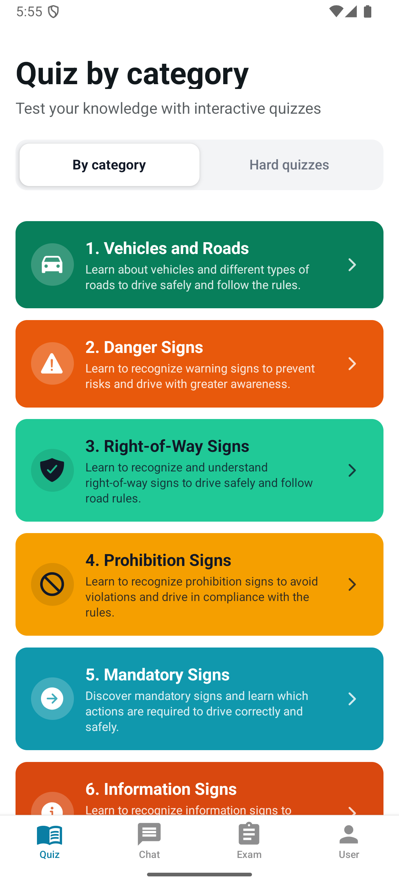
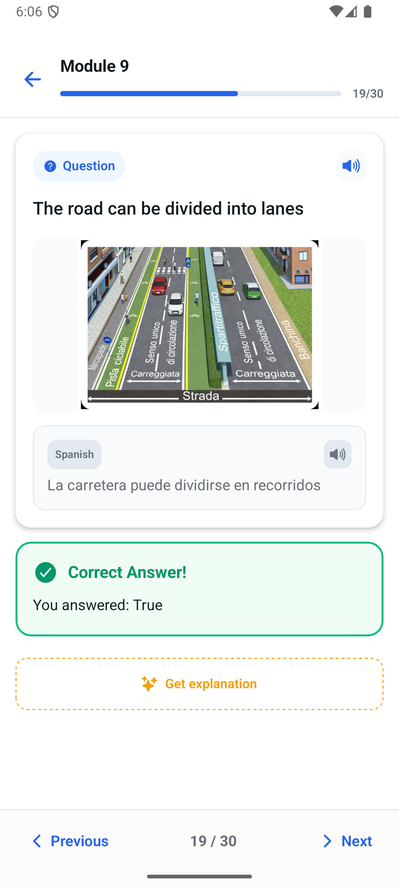
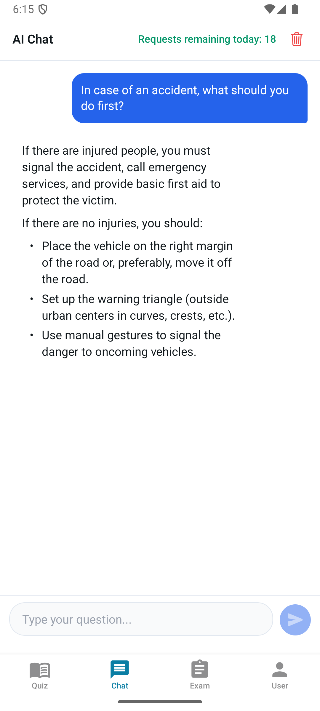

# 🚗 EasyPatente — AI-Powered RAG Platform for Driving License Prep

<p align="center">
  <b>A modern, multi-platform React Native application paired with an enterprise-grade Retrieval-Augmented Generation (RAG) backend designed to help users pass the Italian driving license exam.</b>
</p>

---

## 📸 Screenshots & UI Preview

<p align="center">
  <!-- Place your app screenshots here -->
  
  &nbsp;&nbsp;&nbsp;&nbsp;
  
  &nbsp;&nbsp;&nbsp;&nbsp;
  
</p>

---

## ✨ Key Features

- 🧠 **Context-Aware Multimodal RAG Explanations**: Instantly explains True/False quiz questions based strictly on the official driving manual using vector embeddings (`pgvector`) and multimodal LLMs (vision-enabled for road sign and traffic situation analysis).
- 💬 **Interactive AI Driving Tutor**: A full-featured conversational chatbot backed by real-time manual retrieval, conversation memory (last 10 turns), and custom daily rate-limiting.
- 🌐 **Dual-Language Interface (13+ Languages)**: Designed for foreign learners in Italy. Displays primary and secondary languages side-by-side (e.g., Italian + Spanish/English/Bengali) with offline pre-translated questions and on-demand LLM explanations.
- ⏱️ **Official Exam Simulation & Error Analytics**: Real-time timed exam mode mimicking the official ministry test format, mistake history tracking, category breakdown, and Text-to-Speech (TTS) integration.
- 🔒 **Enterprise Guardrails & Performance**: Caching layer for AI explanations to minimize API latency and costs, email domain restrictions for user onboarding, and dynamic remote feature flags.

---

## 📐 System Architecture

```
┌──────────────────────────────────────────────────────────────────┐
│                      SUPABASE BACKEND (Cloud)                    │
│                                                                  │
│  ┌────────────────────┐ ┌───────────────────┐ ┌───────────────┐  │
│  │ PostgreSQL + Vector│ │ Supabase Storage  │ │ Supabase Auth │  │
│  │ (questions, chunks,│ │ (Road sign images)│ │ (JWT / Session│  │
│  │  explanations)     │ └─────────┬─────────┘ └───────┬───────┘  │
│  └─────────┬──────────┘           │                   │          │
│            │                      │                   │          │
│  ┌─────────┴──────────────────────┴───────────────────┴───────┐  │
│  │                    Supabase Edge Functions                 │  │
│  │  • explain-question (Vector match + Multimodal LLM + Cache)│  │
│  │  • chat (RAG retrieval + Memory + Rate-limiting)           │  │
│  └───────────────────────────────┬────────────────────────────┘  │
└──────────────────────────────────┼───────────────────────────────┘
                                   │
                     ┌─────────────┼─────────────┐
                     │             │             │
                     v             v             v
             ┌──────────────┐ ┌──────────┐ ┌──────────────┐
             │ React Native │ │ LLM API  │ │ Embeddings   │
             │ Mobile Client│ │ (Gemini /│ │ (Cloudflare /│
             │ (Expo SDK 55)│ │LM Studio)│ │ LM Studio)   │
             └──────────────┘ └──────────┘ └──────────────┘
```

---

## 🔍 Retrieval-Augmented Generation (RAG) Deep Dive

The core highlight of **EasyPatente** is its robust RAG pipeline built to prevent model hallucinations and ensure accurate, strictly manual-grounded explanations.

### 1. Manual Indexing Pipeline (`ragPipeline/`)
1. **Document Digitization & OCR**: The official 300+ page Italian driving manual PDF is parsed into high-resolution page images and processed via Vision-LLM OCR into structured Markdown documents.
2. **Semantic Chunking**: Content is split logically into granular chunks containing structural metadata (Chapter, Section, Page number, Article references).
3. **Vector Embedding**: Chunks are embedded into a 768-dimensional vector space using `EmbeddingGemma 300M` and stored in Supabase via PostgreSQL's `pgvector` extension.

### 2. High-Performance Retrieval & Caching (`supabase/functions/`)
- **Semantic Vector Match**: On every question explanation request, `match_manual_chunks` executes a Cosine Distance vector search over `manual_chunks` to fetch the 5 most relevant context snippets.
- **Multimodal Vision Integration**: When a question includes a visual road sign or diagram, the image is passed directly alongside text context to a multimodal model (e.g. Gemini 1.5 Flash or Gemma Vision) using few-shot instruction prompting.
- **Explanation Cache**: Generated explanations are saved to `question_translations.explanation`. Subsequent requests hit the persistent database cache instantly without invoking LLM providers.
- **On-the-fly Translation**: Explanations generated in Italian are dynamically translated to the user's selected secondary language and cached permanently.

---

## 🛠️ Tech Stack

### Mobile Application
- **Framework**: React Native with Expo SDK 55 & Expo Router (File-based Routing)
- **State Management**: Zustand (7 decoupled stores)
- **Internationalization**: `i18next` + `react-i18next` with custom dual-language renderer
- **UI & Native Features**: Expo Speech (TTS), Expo Screen Capture prevention, React Native Image Viewing

### Backend & Cloud Infrastructure
- **Database & Auth**: Supabase PostgreSQL with `pgvector` extension, Row Level Security (RLS), and JWT Auth
- **Serverless Compute**: Deno-based Supabase Edge Functions (`explain-question`, `chat`)
- **Vector Embeddings**: Cloudflare Workers AI (`@cf/google/embeddinggemma-300m`) & LM Studio

### AI & Data Engineering
- **LLM Providers**: Multi-provider support via environment flags:
  - **Google Gemini API** (`gemini-flash-latest`)
  - **Local LLM Server** via LM Studio (`gemma-4-26b-a4b-qat` / `Qwen-2.5-VL`)
- **Offline Data Pipelines**: Python scripts for Excel parsing, NLLB-200 offline translation engine, and image matcher algorithms

---

## 📁 Repository Structure

```
easyPatente/
├── app/                      # Expo Router screens & tab navigation
│   ├── (tabs)/               # Navigation Tabs: Home, Exam, User Profile, Chat
│   ├── quiz.tsx              # Core Quiz screen (Dual-language, AI modal, TTS)
│   ├── examQuiz.tsx          # Timed exam mode
│   └── login.tsx / signup.tsx# Authentication flow
├── hooks/                    # Custom React hooks (state & business logic)
├── queries/                  # Supabase API abstraction layer
├── store/                    # Zustand global stores (user, quiz, feature flags)
├── lib/                      # Supabase client, auth helpers, storage utils
├── supabase/                 # Supabase configuration & Edge Functions
│   └── functions/
│       ├── explain-question/ # RAG Edge Function for question explanations
│       └── chat/             # RAG Edge Function for conversational AI tutor
├── ragPipeline/              # Python pipeline: PDF → OCR → Chunking → Embedding
├── quizConverter/            # Python pipeline: Excel quizzes → Multilingual DB import
└── PROJECT.md                # Comprehensive technical specification
```

---

## 🚀 Getting Started

### Prerequisites
- Node.js (v18+)
- Expo CLI (`npx expo`)
- Supabase Account or local CLI instance

### Mobile App Installation

```bash
# Clone repository
git clone https://github.com/your-username/easyPatente.git
cd easyPatente

# Install dependencies
npm install

# Setup environment variables
cp .env.example .env
```

### Environment Configuration

Configure `.env` with your Supabase credentials:

```env
EXPO_PUBLIC_SUPABASE_URL=https://your-project.supabase.co
EXPO_PUBLIC_SUPABASE_PUBLISHABLE_KEY=your-publishable-key
EXPO_PUBLIC_SUPABASE_STORAGE_URL=https://your-project.supabase.co/storage/v1/object/public/easypatente
```

### Start Development Server

```bash
# Run Expo development server
npx expo start

# Build preview binary for Android
npm run build:preview
```

---

## 📄 License

Distributed under the MIT License. See `LICENSE` for more information.
